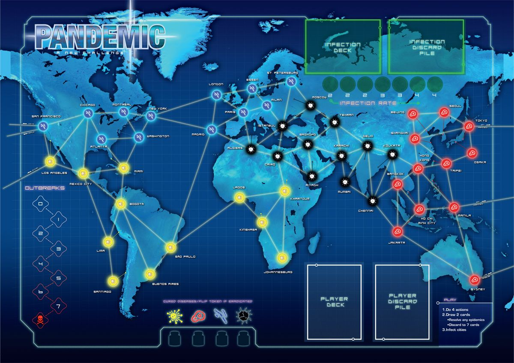

# Pandémie coquille vide

Ceci est un kata reprenant les règles du jeux pandémie. 

Il ne contient que des tests, qui ne compilent pas mais décrivant l'api ainsi que les règles régissant l'univers.

Vous devez développer ces règles en respectant l'API, tout en choisissant le meilleur design possible à l'intérieur du monde.

Voici la carte de Pandémie

